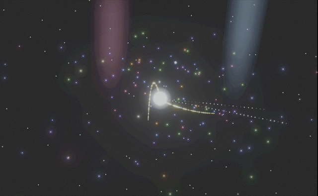

# claude-live

Real-time visualization of [Claude Code](https://docs.anthropic.com/en/docs/claude-code) activity as an orbital solar system.



**[Try the demo](https://marisancans.github.io/claude-live/)** (no install needed)

## Install

```bash
npm install -g claude-live
```

After installing, you need to configure Claude Code hooks so events reach the visualizer. Add this to your `~/.claude/settings.json`:

```json
{
  "hooks": {
    "PreToolUse": [{ "hooks": [{ "type": "command", "command": "node $(npm root -g)/claude-live/bin/hook.js", "async": true }] }],
    "PostToolUse": [{ "hooks": [{ "type": "command", "command": "node $(npm root -g)/claude-live/bin/hook.js", "async": true }] }],
    "SessionStart": [{ "hooks": [{ "type": "command", "command": "node $(npm root -g)/claude-live/bin/hook.js", "async": true }] }],
    "SessionEnd": [{ "hooks": [{ "type": "command", "command": "node $(npm root -g)/claude-live/bin/hook.js", "async": true }] }],
    "SubagentStart": [{ "hooks": [{ "type": "command", "command": "node $(npm root -g)/claude-live/bin/hook.js", "async": true }] }],
    "SubagentStop": [{ "hooks": [{ "type": "command", "command": "node $(npm root -g)/claude-live/bin/hook.js", "async": true }] }],
    "Stop": [{ "hooks": [{ "type": "command", "command": "node $(npm root -g)/claude-live/bin/hook.js", "async": true }] }],
    "Notification": [{ "hooks": [{ "type": "command", "command": "node $(npm root -g)/claude-live/bin/hook.js", "async": true }] }],
    "UserPromptSubmit": [{ "hooks": [{ "type": "command", "command": "node $(npm root -g)/claude-live/bin/hook.js", "async": true }] }],
    "PreCompact": [{ "match": { "trigger": ["manual", "auto"] }, "hooks": [{ "type": "command", "command": "node $(npm root -g)/claude-live/bin/hook.js", "async": true }] }],
    "PostCompact": [{ "match": { "trigger": ["manual", "auto"] }, "hooks": [{ "type": "command", "command": "node $(npm root -g)/claude-live/bin/hook.js", "async": true }] }]
  }
}
```

> **Tip:** Run `npm root -g` to verify your global node_modules path if hooks aren't firing.

## Use

Start the server and open the dashboard:

```bash
claude-live          # Start server on port 43451
claude-live start    # Start server in background
```

Then open http://localhost:43451 in your browser.

If you have the plugin installed, you can also use the slash command inside Claude Code:

```
/claude-live:server          # Check status, auto-start if needed
/claude-live:server stop     # Stop the server
/claude-live:server restart  # Restart the server
/claude-live:server logs     # Show last 30 log lines
```

## How It Works

Sessions appear as star systems. Files orbit as planets -- the more a file is touched, the larger it grows. Tool calls animate between nodes:

- **Read / Grep / Glob** -- scanner at the file, data streams back to core
- **Edit / Write** -- ink beam fires from core to file
- **Bash** -- terminal window appears at the node
- **Subagents** -- satellite systems tethered to their parent

Multiple Claude sessions show as separate star systems. Prompts fly inward, responses fly outward. Context compaction triggers an implosion/rebirth effect.

Under the hood: hooks send every Claude Code event to a lightweight Node.js server (zero dependencies, pure passthrough, no persistence). The server broadcasts to the browser via Server-Sent Events (SSE).

## Server Endpoints

| Endpoint | Method | Description |
|---|---|---|
| `/hook` | POST | Receive hook events, broadcast to SSE clients |
| `/events` | GET | SSE stream for the frontend |
| `/health` | GET | Health check — returns `{"ok":true,"version":"X.Y.Z","clients":<N>,"port":43451}` |

## Troubleshooting

| Symptom | Fix |
|---|---|
| No activity in browser | Check hooks in `~/.claude/settings.json`, restart Claude Code |
| Server not reachable | Run `claude-live` to start it |
| `clients: 0` in `/health` | Open http://localhost:43451 in your browser |

Hook logs are written to `~/.config/claude-live/logs/YYYY-MM-DD.jsonl` for debugging.

## Development

```bash
git clone https://github.com/marisancans/claude-live.git
cd claude-live
npm install

node server/index.js            # Node.js server on :43451
cd client && npm run dev        # Vite hot-reload on :7979
cd client && npx tsc --noEmit   # Type check frontend
```

## License

MIT
